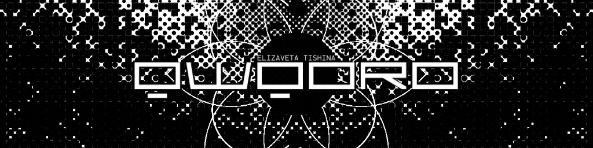

# Hello! 👋

- 🔓 Cyber Security Analysis Specialist
- 🐉 Offensive Security Certified Professional [-informational?style=flat-square&color=eeeeee)]()
- ⚙️ I take part in Web/Mobile Application Penetration Testing
- ⚔️ I participate in CTF events + solve labs
- ⌨️ I hack, code & learn because I love it

	&nbsp;
	

## Interests

 

## Technologies

 

	&nbsp;
	&nbsp;
	&nbsp;
	&nbsp;
	&nbsp;
	&nbsp;
	

